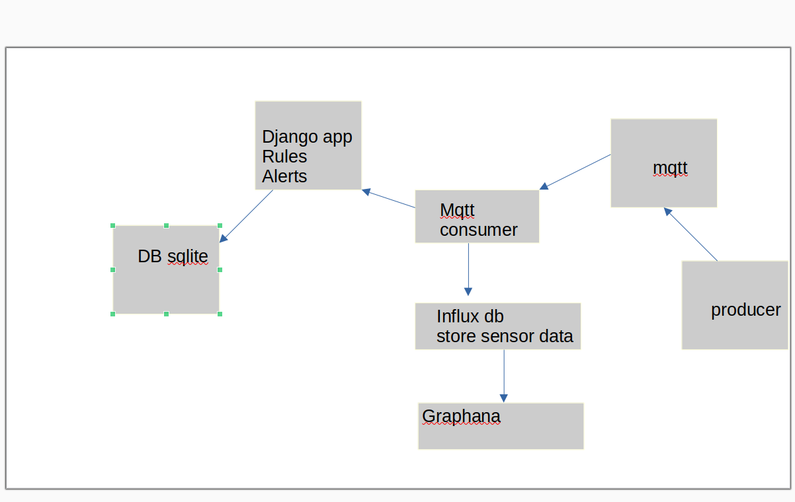
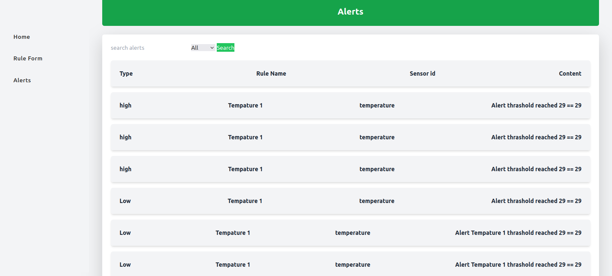
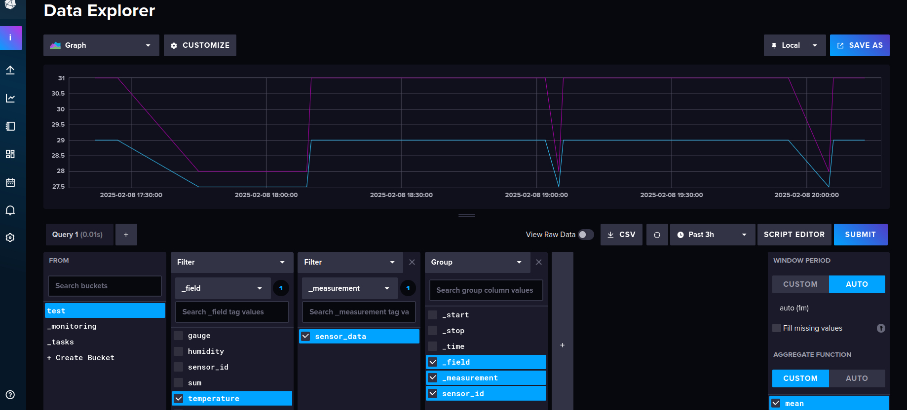

Django App: Rule-Based Alerts with MQTT and InfluxDB

Overview

This Django application is designed to:

Define rules and alerts.

Consume messages from an MQTT broker.

Store data in InfluxDB.

Trigger alerts based on predefined rules.

Features

Rule Management: Users can create, update, and delete rules.

MQTT Integration: Subscribes to topics and processes incoming messages.

InfluxDB Storage: Stores sensor data and logs.

Alert System: Triggers alerts when conditions in rules are met.

Technology Stack

Backend: Django

Messaging: MQTT (via paho-mqtt)

Database: InfluxDB (via influxdb-client)

Caching: Redis (optional, for performance optimization)

#TODO Task Scheduling: Celery (optional, for background processing)

Installation & Setup

1. Clone the Repository

git clone https://github.com/your-repo/django-mqtt-influx.git
cd iot

2. Create a Virtual Environment

python -m venv venv
source venv/bin/activate  # On Windows use `venv\Scripts\activate`

3. Install Dependencies

pip install -r requirement.txt

4. Run the docker of mqtt and influx db
    cd docker-compose-mqtt-influx
    docker-compose up

5. Configure Variables
    cd ..
In the setting.py file and add:

#influx database
influxdb_url=f"http://localhost:8086"
influxdb_username='user'
influxdb_password='password1234'
influxdb_ORG = "some_org"
influxdb_BUCKET = "some_data"
influxdb_POINT="sensor_data"

# MQTT connection
MQTT_BROKER = "mqtt.eclipseprojects.io"
MQTT_PORT = 1883
MQTT_TOPIC = "sensor/temperature"

6. Run Migrations

python manage.py migrate

python manage.py runserver

7. Run producer
cd mqtt_producer
python3 producer.py